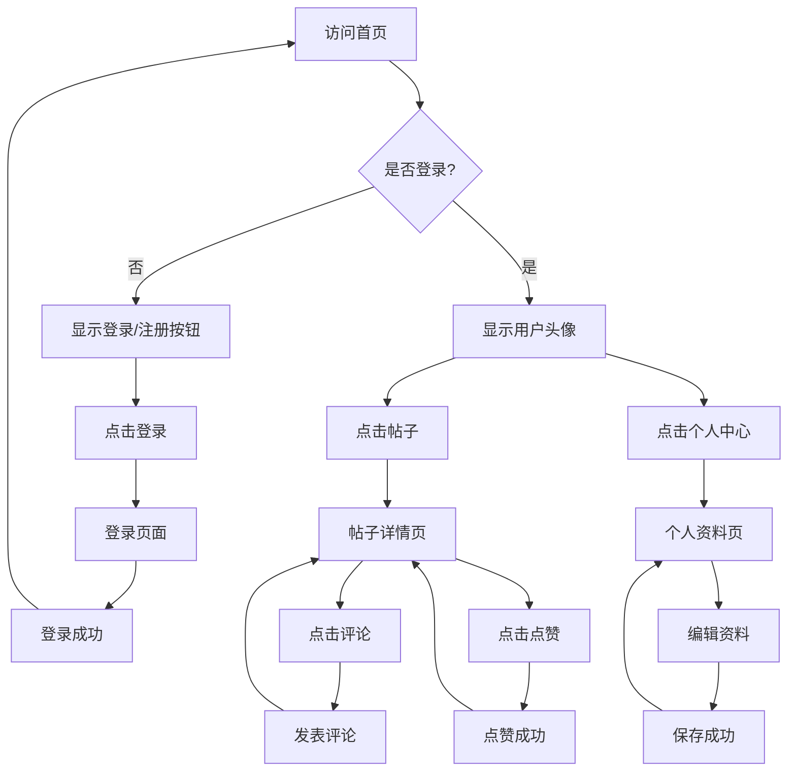
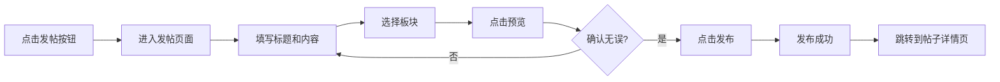
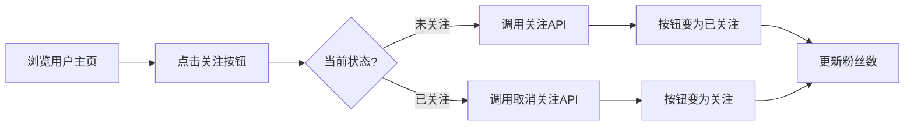

# 前端 UI 设计方案

## 1. 设计概述

### 1.1 设计理念
- **简洁专业**：采用清爽的蓝色系主色调，体现金融投资的专业性与科技感
- **信息清晰**：重点突出股票数据、帖子内容，减少视觉干扰
- **响应式布局**：适配桌面端和移动端，确保多设备良好体验

### 1.2 色彩规范

#### 主色调（蓝色系）
- **主色 Primary**: `#1890FF` - 用于按钮、链接、高亮元素
- **深色 Primary Dark**: `#096DD9` - 用于 hover 状态
- **浅色 Primary Light**: `#E6F7FF` - 用于背景高亮

#### 辅助色
- **成功 Success**: `#52C41A` - 上涨、成功提示
- **警告 Warning**: `#FAAD14` - 提醒、注意
- **错误 Error**: `#FF4D4F` - 下跌、错误提示
- **中性色 Neutral**: 
  - 文字主色: `#262626`
  - 文字次色: `#595959`
  - 边框色: `#D9D9D9`
  - 背景色: `#F5F5F5`

### 1.3 字体规范
- **中文字体**: -apple-system, BlinkMacSystemFont, "Segoe UI", Roboto, "Helvetica Neue", Arial, "Noto Sans SC", sans-serif
- **英文字体**: -apple-system, BlinkMacSystemFont, "Segoe UI", Roboto, "Helvetica Neue", Arial, sans-serif
- **字号体系**:
  - 标题大字: 24px / 20px / 18px
  - 正文: 14px
  - 辅助文字: 12px

### 1.4 间距系统
采用 8px 网格系统：
- 极小间距: 4px
- 小间距: 8px
- 中等间距: 16px
- 大间距: 24px
- 超大间距: 32px / 48px

---

## 2. 整体布局架构 (Layout)

### 2.1 页面结构
```
┌─────────────────────────────────────────────┐
│              顶部导航栏 (Navbar)              │
├──────────┬──────────────────────┬───────────┤
│          │                      │           │
│  左侧    │      主体内容区       │   右侧    │
│  侧边栏  │     (Main Content)   │   侧边栏  │
│ (Menu)   │                      │ (Widget)  │
│          │                      │           │
├──────────┴──────────────────────┴───────────┤
│              底部信息栏 (Footer)              │
└─────────────────────────────────────────────┘
```

### 2.2 组件说明

#### 顶部导航栏 (Navbar)
- **高度**: 64px
- **背景**: 白色 `#FFFFFF`，带底部阴影
- **包含元素**:
  - Logo + 项目名称（左侧）
  - 全局搜索框（中间，支持帖子/用户/群组搜索）
  - 消息通知图标（未读红点提示）
  - 用户头像下拉菜单（右侧，含个人中心、设置、退出登录）
  - 登录/注册按钮（未登录时显示）

#### 左侧侧边栏 (Left Sidebar)
- **宽度**: 200px（固定）
- **功能菜单**:
  - 🏠 首页/热榜
  - 👥 关注动态
  - 📊 自选股讨论
  - 💬 我的群组
  - ⭐ 收藏夹
  - 📝 我的帖子
  - 🔧 管理中心（仅管理员可见）

#### 右侧侧边栏 (Right Sidebar)
- **宽度**: 280px（固定）
- **小组件**:
  - 热门话题标签云
  - 推荐关注的用户
  - 今日股市概览（简化版指数展示）
  - 广告位（预留）

#### 主体内容区 (Main Content)
- **宽度**: 自适应（最小宽度 600px）
- **背景**: 浅灰色 `#F5F5F5`
- **内边距**: 24px

#### 底部信息栏 (Footer)
- **高度**: 120px
- **内容**: 友情链接、版权声明、联系方式

---

## 3. 核心页面设计

### 3.1 首页 / 帖子列表页 (`/`)

#### 页面布局
```
┌─────────────────────────────────────────────┐
│  [筛选 tabs] 最新 | 最热 | 精华 | 关注       │
├─────────────────────────────────────────────┤
│  ┌───────────────────────────────────────┐  │
│  │  📌 置顶帖子卡片                        │  │
│  └───────────────────────────────────────┘  │
│  ┌───────────────────────────────────────┐  │
│  │  帖子卡片 1                             │  │
│  └───────────────────────────────────────┘  │
│  ┌───────────────────────────────────────┐  │
│  │  帖子卡片 2                             │  │
│  └───────────────────────────────────────┘  │
│  ...                                        │
│  [加载更多 / 分页控件]                       │
└─────────────────────────────────────────────┘
```

#### 核心组件：帖子卡片 (PostCard)
- **样式**: 白色背景，圆角 8px，轻微阴影，hover 时阴影加深
- **包含元素**:
  - 顶部：作者头像、昵称、发布时间、所属板块标签
  - 中部：帖子标题（加粗，18px）、摘要文本（最多 3 行）
  - 底部：点赞数 ❤️、评论数 💬、浏览量 👁️、分享按钮
  - 特殊标记：置顶图标 📌、精华图标 ⭐、热门图标 🔥

#### 筛选 Tabs
- **样式**: 横向排列，选中项底部蓝色下划线
- **选项**: 最新、最热、精华、关注（登录后显示）

---

### 3.2 帖子详情页 (`/post/:id`)

#### 页面布局
```
┌─────────────────────────────────────────────┐
│  ← 返回列表                                  │
├─────────────────────────────────────────────┤
│  ┌───────────────────────────────────────┐  │
│  │  帖子标题 (24px, 加粗)                  │  │
│  │  作者信息 + 发布时间 + 编辑/删除按钮     │  │
│  ├───────────────────────────────────────┤  │
│  │                                       │  │
│  │  富文本内容区                           │  │
│  │  (支持图片、代码块、表格等)              │  │
│  │                                       │  │
│  ├───────────────────────────────────────┤  │
│  │  [点赞] [收藏] [分享] [举报]           │  │
│  └───────────────────────────────────────┘  │
│                                             │
│  ┌───────────────────────────────────────┐  │
│  │  评论区                                 │  │
│  │  ┌─────────────────────────────────┐  │  │
│  │  │  评论输入框                       │  │  │
│  │  └─────────────────────────────────┘  │  │
│  │  ┌─────────────────────────────────┐  │  │
│  │  │  评论列表（嵌套回复）             │  │  │
│  │  └─────────────────────────────────┘  │  │
│  └───────────────────────────────────────┘  │
└─────────────────────────────────────────────┘
```

#### 核心组件

**富文本渲染器 (RichTextViewer)**
- 支持 Markdown 语法解析
- 代码块高亮显示
- 图片懒加载 + 点击放大
- 表格美化样式

**评论区 (CommentSection)**
- 一级评论按时间排序
- 二级回复折叠显示（点击展开）
- 每条评论包含：头像、昵称、时间、内容、点赞、回复按钮
- 支持 @用户 功能（高亮显示）

**操作栏 (ActionBar)**
- 点赞按钮：点击后变红色，数字 +1
- 收藏按钮：点击后变黄色，加入收藏夹
- 分享按钮：弹出分享二维码/链接
- 举报按钮：弹出举报原因选择框

---

### 3.3 发帖/编辑页 (`/post/create` | `/post/:id/edit`)

#### 页面布局
```
┌─────────────────────────────────────────────┐
│  标题: [_______________________________]     │
│  板块: [下拉选择 ▼]                          │
├─────────────────────────────────────────────┤
│  ┌───────────────────────────────────────┐  │
│  │                                       │  │
│  │     富文本编辑器                        │  │
│  │     (工具栏: B I U 链接 图片 代码...)  │  │
│  │                                       │  │
│  │                                       │  │
│  └───────────────────────────────────────┘  │
├─────────────────────────────────────────────┤
│  [预览] [发布] [保存草稿]                    │
└─────────────────────────────────────────────┘
```

#### 核心组件：富文本编辑器 (RichTextEditor)
- **工具栏功能**:
  - 粗体、斜体、下划线
  - 插入链接、图片、视频
  - 代码块（支持语言选择）
  - 引用、列表、表格
  - 表情符号
- **特性**:
  - 实时预览模式切换
  - 自动保存草稿（本地存储）
  - 图片拖拽上传
  - 字数统计

---

### 3.4 用户中心 (`/user/:id` | `/profile`)

#### 页面布局
```
┌─────────────────────────────────────────────┐
│  ┌───────────────────────────────────────┐  │
│  │  封面图背景                             │  │
│  │  ┌──────┐                             │  │
│  │  │ 头像 │  昵称  @用户名               │  │
│  │  └──────┘  个人简介...                 │  │
│  │            [关注] [私信] [更多▼]       │  │
│  │            关注 128 | 粉丝 256 | 帖子 89│  │
│  └───────────────────────────────────────┘  │
├─────────────────────────────────────────────┤
│  [我的帖子] [我的收藏] [关于我] [设置]       │
├─────────────────────────────────────────────┤
│  内容区（根据 tab 切换）                     │
└─────────────────────────────────────────────┘
```

#### 核心组件

**个人资料头部 (ProfileHeader)**
- 大尺寸头像（80x80px）
- 昵称、用户名、认证标识
- 个人简介（最多 200 字）
- 关注/粉丝/帖子统计数据
- 操作按钮：关注/已关注、私信、更多（举报/屏蔽）

**资料编辑表单 (ProfileEditForm)**
- 头像上传（裁剪功能）
- 昵称修改
- 个人简介编辑
- 社交链接（GitHub、Twitter 等）
- 隐私设置（是否公开邮箱、是否允许私信）

---

### 3.5 登录/注册页 (`/login` | `/register`)

#### 页面布局（居中卡片式）
```
         ┌──────────────────────┐
         │   📈 股票投资论坛     │
         │                      │
         │  [邮箱/用户名输入框]  │
         │  [密码输入框]         │
         │  [ ] 记住我           │
         │                      │
         │  [    登录按钮    ]   │
         │                      │
         │  忘记密码? | 注册账号  │
         │                      │
         │  ———— 第三方登录 ————│
         │  [GitHub] [微信]     │
         └──────────────────────┘
```

#### 核心组件：认证表单 (AuthForm)
- **字段验证**:
  - 邮箱格式验证
  - 密码强度提示（弱/中/强）
  - 用户名唯一性实时校验
- **交互**:
  - 登录失败提示（红色边框 + 错误信息）
  - 加载状态（按钮显示 loading 动画）
  - 验证码输入（防止暴力破解）

---

### 3.6 私信聊天页 (`/messages/:userId`)

#### 页面布局
```
┌─────────────────────────────────────────────┐
│  ← 返回  |  对方昵称  [在线/离线状态]        │
├─────────────────────────────────────────────┤
│  ┌───────────────────────────────────────┐  │
│  │                                       │  │
│  │  消息列表（滚动区域）                   │  │
│  │  ○ 对方: 你好!                         │  │
│  │                     我: 你好呀! ●      │  │
│  │  ○ 对方: 最近股市怎么样?               │  │
│  │                                       │  │
│  └───────────────────────────────────────┘  │
├─────────────────────────────────────────────┤
│  [输入消息...]              [发送] [表情]    │
└─────────────────────────────────────────────┘
```

#### 核心组件

**消息气泡 (MessageBubble)**
- 对方消息：左对齐，灰色背景
- 我的消息：右对齐，蓝色背景 `#1890FF`
- 显示时间戳（鼠标悬停时）
- 支持图片、表情、链接

**聊天输入框 (ChatInput)**
- 多行文本输入（自动增高）
- 表情选择器
- 图片上传
- Enter 发送，Shift+Enter 换行

---

### 3.7 群组页面 (`/groups` | `/group/:id`)

#### 群组列表页
- **卡片式布局**：每个群组一张卡片
- **卡片内容**: 群组头像、名称、简介、成员数、今日活跃度
- **筛选**: 全部、我加入的、热门的

#### 群组详情页
- 类似帖子列表页，但只显示该群组内的帖子
- 顶部显示群组信息和管理按钮（群主/管理员可见）
- 侧边栏显示群组成员列表

---

### 3.8 管理端页面 (`/admin`)

#### 仪表盘布局
```
┌─────────────────────────────────────────────┐
│  数据统计卡片                                │
│  [总用户] [今日发帖] [待审核] [举报数]       │
├─────────────────────────────────────────────┤
│  [用户管理] [帖子审核] [举报处理] [系统设置] │
├─────────────────────────────────────────────┤
│  内容区（根据功能切换）                      │
└─────────────────────────────────────────────┘
```

#### 核心功能模块
- **用户管理**: 表格展示，支持搜索、封禁、解封
- **帖子审核**: 待审核帖子列表，快速通过/拒绝
- **举报处理**: 举报详情，处理操作（删除/警告/封禁）
- **敏感词管理**: 添加/删除敏感词库

---

## 4. 交互流程设计

### 4.1 用户操作流程



### 4.2 发帖流程



### 4.3 关注流程



---

## 5. 公共组件库设计

### 5.1 基础组件

| 组件名 | 用途 | 说明 |
|--------|------|------|
| `Button` | 按钮 | 支持 primary/default/danger/ghost 类型，size: large/default/small |
| `Input` | 输入框 | 支持前缀/后缀图标，错误状态，禁用状态 |
| `Select` | 下拉选择 | 支持搜索、多选、自定义选项 |
| `Modal` | 弹窗 | 支持自定义标题、内容、底部按钮 |
| `Tooltip` | 提示气泡 | 鼠标悬停显示提示信息 |
| `Badge` | 徽章 | 显示数字角标或状态点 |
| `Avatar` | 头像 | 支持图片、文字 fallback，不同尺寸 |
| `Tag` | 标签 | 不同颜色表示不同状态 |
| `Loading` | 加载动画 | 全屏/局部 loading 状态 |
| `Empty` | 空状态 | 无数据时的占位图 |

### 5.2 业务组件

| 组件名 | 用途 | 说明 |
|--------|------|------|
| `PostCard` | 帖子卡片 | 首页列表使用 |
| `CommentItem` | 评论项 | 评论区单条评论 |
| `UserCard` | 用户卡片 | 推荐用户、搜索结果 |
| `GroupCard` | 群组卡片 | 群组列表使用 |
| `RichTextEditor` | 富文本编辑器 | 发帖/回复使用 |
| `SearchBox` | 搜索框 | 全局搜索 |
| `NotificationBell` | 消息铃铛 | 未读消息提示 |

---

## 6. 响应式设计

### 6.1 断点定义
- **移动端**: < 768px
- **平板端**: 768px - 1024px
- **桌面端**: > 1024px

### 6.2 适配策略

#### 移动端 (< 768px)
- 隐藏左右侧边栏，仅保留主体内容
- 导航栏改为汉堡菜单
- 帖子卡片全宽显示
- 评论区改为单列布局
- 富文本编辑器简化为纯文本输入

#### 平板端 (768px - 1024px)
- 保留左侧侧边栏（可折叠）
- 隐藏右侧侧边栏
- 主体内容区自适应宽度

#### 桌面端 (> 1024px)
- 完整三栏布局
- 最大宽度限制为 1440px，居中显示

---

## 7. 动画与过渡效果

### 7.1 微交互
- **按钮 Hover**: 背景色渐变，轻微上移 2px
- **卡片 Hover**: 阴影加深，scale(1.02)
- **点赞动画**: 心形图标弹跳 + 粒子效果
- **加载骨架屏**: 灰色闪烁动画

### 7.2 页面过渡
- 路由切换：淡入淡出（fade-in/out），时长 300ms
- 弹窗出现：从底部滑入（slide-up），时长 200ms
- 下拉菜单：展开/收起动画，时长 150ms

---

## 8. 无障碍设计 (Accessibility)

- **键盘导航**: 所有交互元素可通过 Tab 键访问
- **焦点样式**: 清晰的蓝色焦点环
- **ARIA 标签**: 为图标按钮添加 aria-label
- **对比度**: 文字与背景对比度符合 WCAG AA 标准
- **屏幕阅读器**: 图片添加 alt 文本，表单添加 label

---

## 9. 技术实现建议

### 9.1 CSS 方案
- 推荐使用 **Tailwind CSS** 或 **Ant Design Vue** 组件库
- 自定义主题变量覆盖默认蓝色系

### 9.2 状态管理
- 用户登录状态：Pinia Store
- 主题配置：localStorage 持久化

### 9.3 性能优化
- 图片懒加载（Intersection Observer）
- 虚拟滚动（长列表优化）
- 路由懒加载（Code Splitting）
- API 请求缓存（SWR / TanStack Query）

---

## 10. 设计稿交付物清单

- [x] 页面结构布局图
- [x] 色彩规范文档
- [x] 组件库清单
- [x] 交互流程图（Mermaid）
- [ ] Figma/Sketch 设计稿（可选，后续补充）
- [ ] 原型演示（可选，使用 Framer 或 Axure）

---

**文档版本**: v1.0  
**最后更新**: 2026-05-15  
**负责人**: 前端A（赵六）、前端B（孙七）  
**审核人**: 组长（张三）
