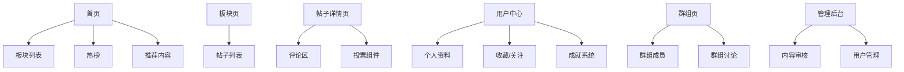
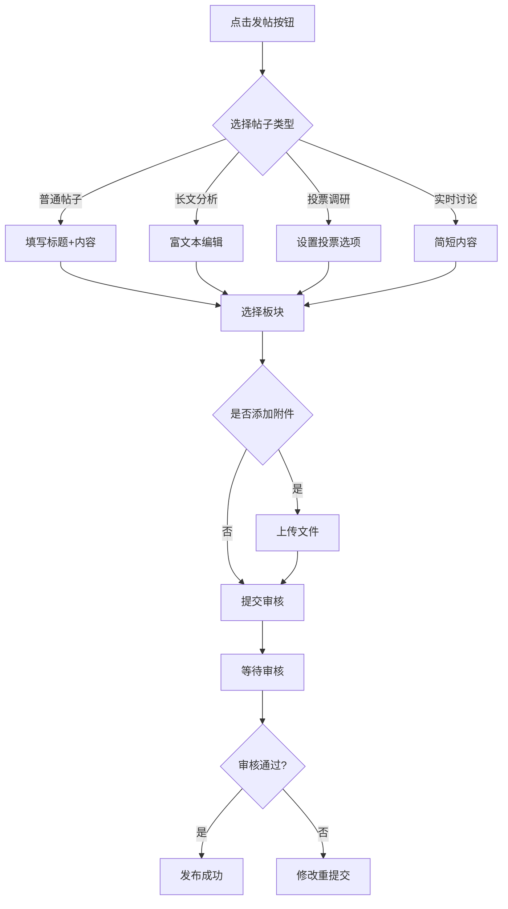
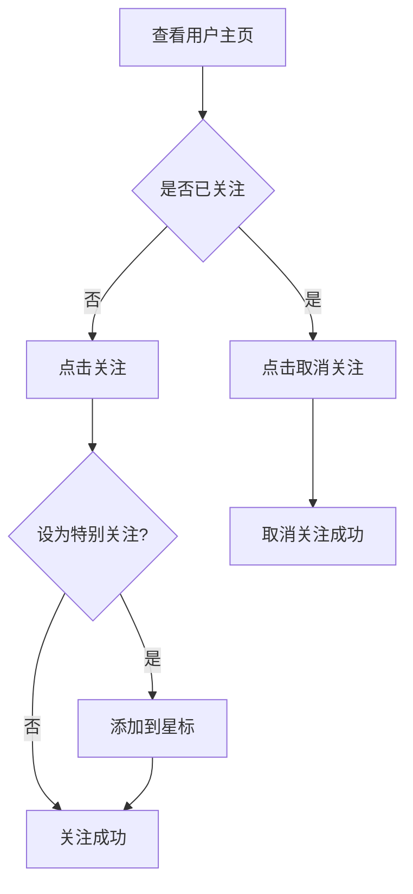

# 股票基金投资论坛 - 前端UI设计文档

## 1. 设计概述

### 1.1 项目背景

股票基金投资论坛是一个面向投资者的专业社区平台，提供股票、基金投资相关的讨论、分析和社交功能。

### 1.2 设计原则

| 原则 | 说明 |
|------|------|
| **专业性** | 金融投资社区，界面风格稳重专业 |
| **易用性** | 清晰的信息架构，直观的操作流程 |
| **响应式** | 支持PC端和移动端访问 |
| **一致性** | 统一的设计语言和交互模式 |
| **可访问性** | 符合无障碍设计标准 |

### 1.3 设计目标

- 提供专业、简洁的投资交流界面
- 支持多样化的内容展示（图文、投票、长文分析）
- 实现流畅的社交互动体验
- 提供个性化的内容推荐

---

## 2. 页面架构

### 2.1 页面结构总览



### 2.2 页面路由表

| 页面名称 | 路由路径 | 说明 |
|----------|----------|------|
| 首页 | `/` | 推荐内容、热榜、板块导航 |
| 板块列表 | `/sections` | 所有板块分类展示 |
| 板块详情 | `/sections/:id` | 特定板块帖子列表 |
| 帖子详情 | `/posts/:id` | 帖子内容、评论、投票 |
| 创建帖子 | `/posts/create` | 发帖表单页面 |
| 用户中心 | `/users/:id` | 用户个人主页 |
| 个人设置 | `/settings` | 用户资料修改 |
| 关注列表 | `/follows` | 关注/粉丝列表 |
| 群组列表 | `/groups` | 群组发现页面 |
| 群组详情 | `/groups/:id` | 群组主页 |
| 私信页面 | `/messages` | 私信列表和聊天 |
| 搜索结果 | `/search` | 全文搜索结果 |
| 管理后台 | `/admin` | 管理员后台 |

---

## 3. 组件设计

### 3.1 通用组件

#### 3.1.1 Header（头部导航）

| 元素 | 功能 | 状态 |
|------|------|------|
| Logo | 品牌标识，点击返回首页 | 始终显示 |
| 搜索框 | 全站搜索入口 | 始终显示 |
| 导航菜单 | 首页、板块、群组、消息 | 始终显示 |
| 用户头像 | 快捷入口（登录/个人中心） | 登录后显示 |
| 通知图标 | 消息提醒数量 | 有未读时显示红点 |

**设计规格：**
- 高度：60px
- 背景：白色/深色主题切换
- 响应式：移动端折叠为汉堡菜单

#### 3.1.2 Sidebar（侧边栏）

| 模块 | 内容 |
|------|------|
| 板块导航 | 市场讨论区、主题专区、公司研究 |
| 快捷入口 | 发帖、问答求助、精华推荐 |
| 在线用户 | 在线人数、热门用户 |

**设计规格：**
- 宽度：280px
- 移动端：收起为悬浮按钮

#### 3.1.3 PostCard（帖子卡片）

| 元素 | 说明 |
|------|------|
| 用户头像 | 作者头像 |
| 用户信息 | 用户名、认证标识、发布时间 |
| 板块标签 | 所属板块 |
| 标题 | 帖子标题（高亮关键词） |
| 摘要 | 内容预览（首段或指定摘要） |
| 配图 | 首图预览（如有） |
| 互动数据 | 浏览量、点赞数、评论数 |
| 帖子类型 | 普通/长文/投票/讨论标识 |

**设计规格：**
- 卡片高度：自适应（约150-200px）
- 圆角：8px
- 阴影：hover时增强

#### 3.1.4 CommentItem（评论项）

| 元素 | 说明 |
|------|------|
| 用户头像 | 评论者头像 |
| 用户信息 | 用户名、发布时间 |
| 评论内容 | 支持@提及高亮 |
| 互动按钮 | 点赞、回复、举报 |
| 楼中楼入口 | 显示子评论数量 |

**设计规格：**
- 层级缩进：子评论缩进20px
- 背景：hover时高亮

#### 3.1.5 UserCard（用户卡片）

| 元素 | 说明 |
|------|------|
| 头像 | 用户头像 |
| 用户名 | 昵称 + 认证标识 |
| 简介 | 个人简介 |
| 标签 | 投资经验标签 |
| 数据 | 帖子数、关注数、粉丝数 |
| 操作按钮 | 关注/已关注、私信 |

---

### 3.2 页面专属组件

#### 3.2.1 首页组件

**HotTopicList（热榜列表）**
- 排名标识（TOP1-3特殊样式）
- 热度分数/趋势
- 话题类型标签

**RecommendFeed（推荐流）**
- 内容卡片瀑布流/列表切换
- 智能推荐标识
- 兴趣标签筛选

#### 3.2.2 帖子详情组件

**VotePanel（投票面板）**
- 选项列表（带进度条）
- 投票按钮（单选/多选）
- 剩余时间显示

**AttachmentList（附件列表）**
- 文件图标（PDF/Excel等）
- 文件大小、上传时间
- 下载按钮

#### 3.2.3 发帖组件

**RichEditor（富文本编辑器）**
- 格式化工具栏（加粗、斜体、链接、图片）
- 图表插入功能
- 实时预览

**PollCreator（投票创建器）**
- 选项动态添加/删除
- 单选/多选切换
- 截止时间设置

#### 3.2.4 用户中心组件

**AchievementPanel（成就面板）**
- 等级进度条
- 荣誉勋章展示
- 影响力值

**StatsCard（数据统计）**
- 发帖趋势图
- 互动数据汇总

---

## 4. 交互设计

### 4.1 核心交互流程

#### 4.1.1 发帖流程



#### 4.1.2 评论流程

```mermaid
flowchart TD
    A[查看帖子] --> B[浏览评论]
    B --> C[输入评论内容]
    C --> D{@提及用户}
    D -->|是| E[选择用户]
    D -->|否| F[提交评论]
    E --> F
    F --> G[评论显示]
    G --> H{回复评论}
    H -->|是| I[楼中楼回复]
    H -->|否| J[结束]
```

#### 4.1.3 关注流程



### 4.2 微交互设计

| 交互场景 | 设计方案 |
|----------|----------|
| 点赞 | 点击图标放大动画 + 数字跳动 |
| 收藏 | 星星填充动画 |
| 评论输入 | 字数统计、@提及自动补全 |
| 滚动加载 | 无限滚动/分页切换 |
| 通知提醒 | 红点计数 + 下拉列表 |
| 图片预览 | 点击放大查看 |

---

## 5. 视觉设计规范

### 5.1 色彩方案

| 颜色类型 | 色值 | 用途 |
|----------|------|------|
| 主色调 | #2563EB | 品牌色、按钮、链接 |
| 辅助色 | #10B981 | 成功状态、点赞 |
| 警告色 | #F59E0B | 警告提示 |
| 危险色 | #EF4444 | 错误状态、删除 |
| 信息色 | #3B82F6 | 信息提示 |
| 背景色 | #F8FAFC | 页面背景 |
| 卡片背景 | #FFFFFF | 卡片、弹窗 |
| 文字主色 | #1E293B | 标题、正文 |
| 文字辅色 | #64748B | 次要文字 |
| 边框色 | #E2E8F0 | 分隔线、边框 |

### 5.2 字体规范

| 字体类型 | 字号 | 字重 | 用途 |
|----------|------|------|------|
| 页面标题 | 24-32px | 700 | 页面主标题 |
| 卡片标题 | 18px | 600 | 帖子、卡片标题 |
| 正文 | 14px | 400 | 内容文本 |
| 小字 | 12px | 400 | 辅助信息 |
| 按钮文本 | 14px | 500 | 按钮、链接 |

### 5.3 间距规范

| 间距类型 | 数值 | 用途 |
|----------|------|------|
| 页面边距 | 24px | 内容区与边界 |
| 卡片间距 | 16px | 卡片之间 |
| 内容间距 | 12px | 元素内部 |
| 行高 | 1.6-1.8 | 正文行高 |

### 5.4 图标规范

- 图标库：Lucide Icons
- 图标尺寸：16px、20px、24px、32px
- 图标颜色：与文字颜色一致

---

## 6. 状态管理

### 6.1 状态定义

| 状态 | 说明 | 界面表现 |
|------|------|----------|
| loading | 数据加载中 | 骨架屏/加载动画 |
| empty | 无数据 | 空状态提示 + 引导操作 |
| error | 请求失败 | 错误提示 + 重试按钮 |
| success | 操作成功 | 成功提示 + 自动消失 |
| warning | 警告信息 | 警告提示框 |

### 6.2 全局状态

```typescript
interface GlobalState {
  user: User | null;           // 当前用户
  token: string | null;        // 登录令牌
  theme: 'light' | 'dark';     // 主题模式
  notifications: Notification[]; // 通知列表
}
```

### 6.3 页面状态

| 页面 | 状态字段 |
|------|----------|
| 首页 | posts, hotTopics, sections |
| 板块页 | section, posts |
| 帖子详情 | post, comments, vote |
| 用户中心 | user, posts, achievements |

---

## 7. 路由配置

```typescript
const routes = [
  { path: '/', component: HomePage },
  { path: '/sections', component: SectionListPage },
  { path: '/sections/:id', component: SectionDetailPage },
  { path: '/posts/:id', component: PostDetailPage },
  { path: '/posts/create', component: PostCreatePage, requiresAuth: true },
  { path: '/users/:id', component: UserProfilePage },
  { path: '/settings', component: SettingsPage, requiresAuth: true },
  { path: '/follows', component: FollowListPage, requiresAuth: true },
  { path: '/groups', component: GroupListPage },
  { path: '/groups/:id', component: GroupDetailPage },
  { path: '/messages', component: MessagePage, requiresAuth: true },
  { path: '/search', component: SearchPage },
  { path: '/admin', component: AdminPage, requiresAdmin: true },
];
```

---

## 8. 响应式设计

### 8.1 断点配置

| 设备类型 | 断点 | 布局特点 |
|----------|------|----------|
| 移动端 | < 768px | 单列布局，侧边栏收起 |
| 平板 | 768px - 1024px | 两列布局 |
| 桌面端 | > 1024px | 三列布局 |

### 8.2 适配策略

- **导航栏**：移动端折叠为底部导航或汉堡菜单
- **内容区**：卡片宽度自适应，保持可读性
- **图片**：响应式加载，支持懒加载
- **字体**：根据屏幕尺寸动态调整

---

## 9. 性能优化

### 9.1 优化策略

| 策略 | 说明 |
|------|------|
| 懒加载 | 图片、列表内容按需加载 |
| 虚拟滚动 | 长列表性能优化 |
| 缓存策略 | API响应缓存、本地存储 |
| 代码分割 | 按需加载页面组件 |
| CDN加速 | 静态资源分发 |

### 9.2 加载状态设计

- **骨架屏**：页面级加载占位
- **渐进式加载**：先显示文本，再加载图片
- **错误降级**：失败时显示降级内容

---

## 10. 无障碍设计

### 10.1 设计要点

| 要点 | 说明 |
|------|------|
| 键盘导航 | 所有可交互元素支持键盘访问 |
| 屏幕阅读器 | 语义化HTML标签 |
| 对比度 | 文本与背景对比度达标 |
| 焦点指示 | 清晰的焦点样式 |
| 颜色无关 | 不依赖颜色传递信息 |

---

## 11. 设计稿参考

### 11.1 首页布局

```
┌─────────────────────────────────────────────────────────┐
│ Header: Logo | Search | Navigation | User/Notification │
├─────────────────┬───────────────────────────────────────┤
│                 │  ┌─────────────────────────────┐      │
│   Sidebar       │  │      Hot Topics            │      │
│   - Sections    │  │  🔥 TOP1: 今日热门股票    │      │
│   - Quick Links │  │  📈 TOP2: 市场分析        │      │
│   - Online Users│  └─────────────────────────────┘      │
│                 │                                       │
│                 │  ┌─────────────────────────────┐      │
│                 │  │      Recommend Feed         │      │
│                 │  │  ┌─────────────────────┐    │      │
│                 │  │  │   Post Card 1       │    │      │
│                 │  │  └─────────────────────┘    │      │
│                 │  │  ┌─────────────────────┐    │      │
│                 │  │  │   Post Card 2       │    │      │
│                 │  │  └─────────────────────┘    │      │
│                 │  └─────────────────────────────┘      │
└─────────────────┴───────────────────────────────────────┘
```

### 11.2 帖子详情页布局

```
┌─────────────────────────────────────────────────────────┐
│ Header: Back | Share | More                            │
├─────────────────────────────────────────────────────────┤
│                                                         │
│  [Section Tag]  Title of the Post                       │
│                                                         │
│  ┌──────┐  Author Name · Certification · Time         │
│  │Avatar│  [Edit/Delete - Owner only]                  │
│  └──────┘                                               │
│                                                         │
│  [Post Content - Rich Text]                             │
│                                                         │
│  [Vote Panel - if poll type]                            │
│                                                         │
│  [Attachment List]                                      │
│                                                         │
├─────────────────────────────────────────────────────────┤
│  Actions: View:xxx  💖 Like:xxx  💬 Comment:xxx        │
│                                                         │
│  ┌─────────────────────────────────────────────────┐    │
│  │ Comment Input Field                            │    │
│  └─────────────────────────────────────────────────┘    │
│                                                         │
│  ┌─────────────────────────────────────────────────┐    │
│  │ Comment List                                    │    │
│  │  ┌──────┐ User: Comment content...             │    │
│  │  │Avatar│                                      │    │
│  │  └──────┘  💖 Like · Reply · 楼中楼(3)         │    │
│  └─────────────────────────────────────────────────┘    │
└─────────────────────────────────────────────────────────┘
```

---

## 12. 组件清单

| 组件名称 | 文件路径 | 说明 |
|----------|----------|------|
| Header | src/components/Header.vue | 顶部导航栏 |
| Sidebar | src/components/Sidebar.vue | 侧边栏导航 |
| PostCard | src/components/PostCard.vue | 帖子卡片 |
| CommentItem | src/components/CommentItem.vue | 评论项 |
| UserCard | src/components/UserCard.vue | 用户卡片 |
| HotTopicList | src/components/HotTopicList.vue | 热榜列表 |
| VotePanel | src/components/VotePanel.vue | 投票面板 |
| RichEditor | src/components/RichEditor.vue | 富文本编辑器 |
| AchievementPanel | src/components/AchievementPanel.vue | 成就面板 |
| LoadingSkeleton | src/components/LoadingSkeleton.vue | 加载骨架屏 |
| EmptyState | src/components/EmptyState.vue | 空状态提示 |
| NotificationList | src/components/NotificationList.vue | 通知列表 |
